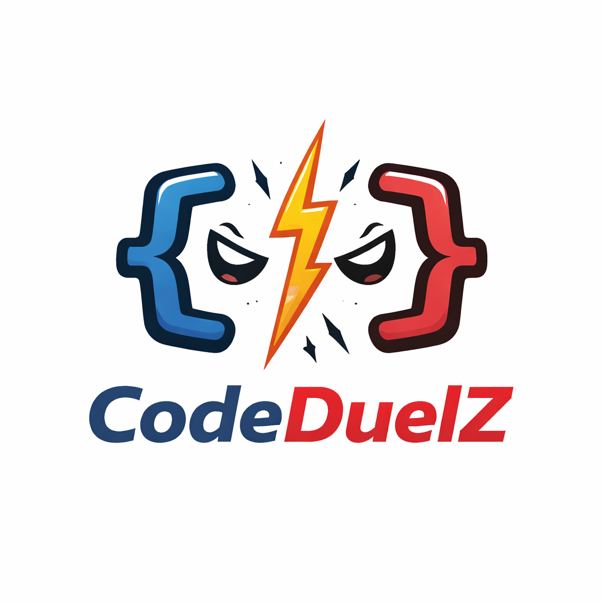

# CodeDuelZ - Real-Time Competitive Coding Platform

<p align="center">
  
</p>

<p align="center">
  <strong>Code. Battle. Dominate.</strong>
</p>

<p align="center">
  The ultimate real-time competitive coding platform. Challenge developers worldwide, climb the ranks, and prove you're the sharpest coder alive.
</p>

---

## Features

### ⚔️ Real-Time Matchmaking
- Sub-50ms matchmaking with WebSocket-powered connections
- Challenge random opponents or friends
- Three difficulty levels: Easy, Medium, Hard

### 🏆 Ranked Competition
- Global leaderboard with rating system
- Win matches to increase your rating
- Podium view for top 3 players

### 💻 Professional Code Editor
- Monaco Editor (same as VS Code)
- Syntax highlighting for 4 languages: C++, Python, Java, JavaScript
- Real-time code execution and testing

### 👥 Social Features
- Friend system with friend requests
- Challenge friends directly
- Online/offline status indicators

### 📊 Stats & Progress
- Match history with win/loss tracking
- External platform integration: LeetCode, Codeforces, CodeChef
- Performance analytics

### 🎨 Beautiful UI
- Dark/Light mode support
- Smooth animations and transitions
- Fully responsive design

---

## Tech Stack

- **Frontend**: React 19 + Vite
- **Styling**: Tailwind CSS 4
- **Code Editor**: Monaco Editor
- **Authentication**: Firebase Auth (Email, Google, GitHub)
- **Real-time**: STOMP over SockJS/WebSocket
- **State**: React hooks

---

## Getting Started

### Prerequisites
- Node.js 18+
- npm or yarn

### Installation

```bash
# Clone the repository
cd CodeDuelZFront

# Install dependencies
npm install

# Start development server
npm run dev
```

### Environment Variables

Create a `.env` file in the root directory:

```env
VITE_API_BASE_URL=http://localhost:8080
```

---

## Project Structure

```
src/
├── components/
│   ├── Navbar.jsx           # Top navigation bar
│   ├── NotificationBell.jsx # Notifications dropdown
│   ├── FindPlayersSearch.jsx # Player search popup
│   ├── MatchSearch.jsx      # Find match UI
│   ├── MatchHistory.jsx     # Match history display
│   ├── QuickStats.jsx       # Stats overview
│   ├── ProfileCard.jsx      # User profile card
│   ├── CompetitiveStats.jsx # Platform stats
│   ├── EditProfiles.jsx     # Profile editing
│   ├── ChallengeModal.jsx   # Challenge dialog
│   └── PlatformCard.jsx    # Platform connection
├── pages/
│   ├── Home.jsx            # Dashboard
│   ├── Profile.jsx         # User profile
│   ├── Leaderboard.jsx     # Rankings
│   ├── UserProfile.jsx     # Public profiles
│   ├── Friends.jsx         # Friends management
│   ├── MatchArena.jsx      # Code editor
│   ├── Login.jsx           # Authentication
│   └── LandingPage.jsx     # Landing page
├── services/
│   ├── api.js              # API calls
│   ├── cache.js            # Local caching
│   └── codeforces.js       # Codeforces API
├── hooks/
│   └── useWebSocket.js     # WebSocket connection
├── config/
│   └── firebase.js         # Firebase config
└── index.css               # Global styles
```

---

## Pages

| Page | Description |
|------|-------------|
| **Landing** | Marketing page with features and CTA |
| **Login** | Email/password, Google, GitHub OAuth |
| **Home** | Dashboard with match search, stats, history |
| **Profile** | Edit profile, competitive stats |
| **Leaderboard** | Global rankings with podium |
| **User Profile** | View other players' profiles |
| **Friends** | Manage friends and challenges |
| **Match Arena** | Code editor for matches |

---

## API Endpoints

The frontend connects to a backend API. Key endpoints:

- `GET /leaderboard` - All players ranked by rating
- `GET /profile/{userId}` - Public user profile
- `GET /profile` - Current user profile (auth required)
- `PUT /profile` - Update profile (auth required)
- `GET /matches/history` - Match history
- `POST /matches` - Create new match
- `GET /external-stats` - Platform stats

---

## Contributing

1. Fork the repository
2. Create your feature branch (`git checkout -b feature/amazing`)
3. Commit your changes (`git commit -m 'Add amazing feature'`)
4. Push to the branch (`git push origin feature/amazing`)
5. Open a Pull Request

---

## License

MIT License - feel free to use this for your own projects!

---

## Screenshots

### Landing Page
Modern marketing page with animated backgrounds and feature showcase.

### Match Arena
Professional Monaco code editor with real-time execution.

### Leaderboard
Podium view for top 3 players + scrollable rankings.

### Home Dashboard
Quick stats, match search, and match history all in one place.

---

<p align="center">Built with ❤️ for competitive coders</p>
